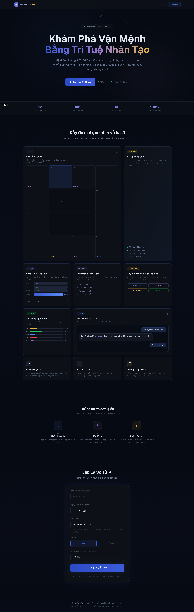

# Tử Vi Đẩu Số — AI Astrology

Vietnamese Zi Wei Dou Shu (Tử Vi Đẩu Số) astrology web app powered by iztro and Gemini AI.



## Features

- **Lá số tử vi** — Generate a full 12-palace Zi Wei Dou Shu chart from birth date, time, and gender
- **12 Cung** — Interactive grid in the classic 4×4 perimeter layout (ziwei.pub dark navy style)
- **Đại Vận** — Detailed 10-year major life period view with timeline, stars, and mutagens
- **Luận giải AI** — Deep Vietnamese interpretation via a 3-layer Gemini prompt system (chained reasoning + self-check + anti-hallucination)
- **Vận hạn** — Current decadal / yearly / monthly horoscope overlay
- **Chat AI** — Follow-up Q&A grounded in the user's own chart data
- **Giờ Tý split** — Correctly handles both 00:00–00:59 (timeIndex 0) and 23:00–23:59 (timeIndex 12)
- iOS 26-style Liquid Glass UI — layered translucent surfaces with specular highlights, adaptive header blur, squircle/pill controls, spring motion, animated star field, and orbiting particles
- Shared background system on every screen — fixed full-viewport drifting aurora blobs (azure, violet, gold, fuchsia), animated starfield, and a subtle noise texture behind all glass surfaces
- Fraunces (display) + Inter (body) typography via `next/font/google`

## Tech Stack

| Layer | Technology |
|---|---|
| Framework | Next.js 16 (App Router) |
| Language | TypeScript 5 |
| Styling | Tailwind CSS v4 |
| Astrology engine | iztro v2.5.8 |
| AI | Google Gemini (`@google/genai`) |
| Runtime | React 19 |

## Getting Started

### 1. Install dependencies

```bash
npm install
```

### 2. Configure environment

Create a `.env.local` file:

```env
GEMINI_API_KEY=your_gemini_api_key_here
```

Get a key from [Google AI Studio](https://aistudio.google.com/app/apikey).

### 3. Run the dev server

```bash
npm run dev
```

Open [http://localhost:3000](http://localhost:3000).

## Project Structure

```
src/
├── app/
│   ├── page.tsx              # Landing / birth input form
│   ├── loading/page.tsx      # Dedicated route that runs the pending analyze/candidates call, then routes to /result or back to the form
│   ├── result/page.tsx       # Chart result page (5 tabs)
│   └── api/
│       ├── analyze/route.ts  # POST /api/analyze — chart generation + AI interpretation
│       └── chat/route.ts     # POST /api/chat — follow-up Q&A
├── components/
│   ├── chart/
│   │   ├── ChartGrid.tsx     # 4×4 palace grid
│   │   ├── ChartSummary.tsx  # Overview panel
│   │   ├── PalaceDetail.tsx  # Expanded palace drawer
│   │   ├── DecadalView.tsx   # Đại vận timeline
│   │   └── Interpretation.tsx # Personalized hero pull-quote, highlight cards, category tabs (insight + markdown + citations)
│   ├── chat/
│   │   └── ChatPanel.tsx     # Chat panel docked on the result page (stacks below content on mobile)
│   └── ui/
│       ├── Header.tsx
│       ├── Footer.tsx
│       ├── GlassEffects.tsx  # Cursor-tracked specular highlight tracking for glass surfaces
│       └── LoadingScreen.tsx # Animated loading screen rendered by the /loading route
├── lib/
│   ├── iztro.ts              # Chart generation (no timezone conversion)
│   └── gemini.ts             # 3-layer AI prompt system
└── types/index.ts            # Shared TypeScript types
```

## AI Prompt Architecture (`src/lib/gemini.ts`)

The Gemini prompt is split into three layers:

1. **System Instruction** — Immutable expert identity, epistemic rules (no hallucinated stars, cross-palace consistency, Mệnh cung as root), tone control (no fear-mongering, no flattery), and output discipline. Loaded via `systemInstruction` so it cannot be overridden by prompt content.

2. **Data Context** — Structured chart dump: birth info, all 12 palaces with stars/brightness/mutagens/changsheng/decadal range, current horoscope overlay.

3. **Chained Reasoning + Self-Check + Task** — Forces the model to:
   - Internally reason through core chart, cross-palace correlations, contradiction detection, and horoscope evaluation (Step A–D, not printed)
   - Run a 6-point self-check gate before writing (completeness, no invented stars, Mệnh consistency, no silent contradictions, tone, negative-indicator handling)
   - Output a structured 5-section Vietnamese interpretation only after passing the gate

Alongside this, `analyzeHighlights()` makes a separate structured-output Gemini call (JSON schema, `responseMimeType: 'application/json'`) to derive the short hero highlights (strength / caution / favorable period) and one insight per category tab, grounded in the same chart data. Validated against the expected shape before use, with a safe Vietnamese fallback if the response is missing or malformed.

## Birth Time Notes

iztro timeIndex mapping used:

| Value | Label | Time range |
|---|---|---|
| 0 | Tý (early) | 00:00–00:59 |
| 1–11 | Sửu → Hợi | 01:00–22:59 |
| 12 | Tý (late) | 23:00–23:59 |

No timezone conversion is applied — birth time is passed directly to iztro.

## Build

```bash
npm run build
npm run start
```
