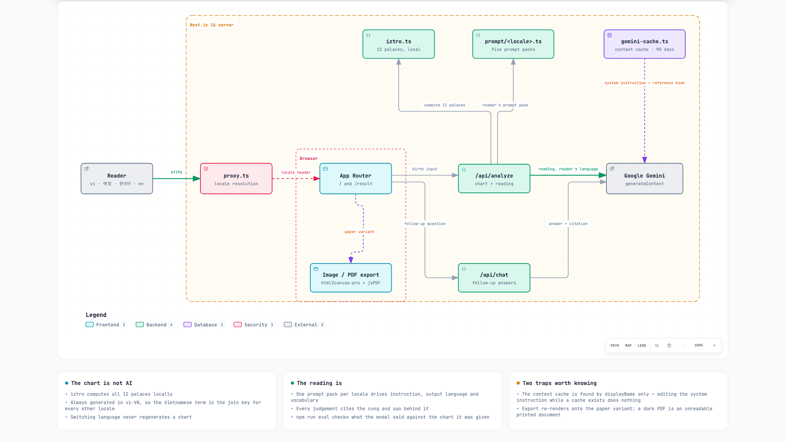

# astro-lens

**English** · [Tiếng Việt](README.vi.md) · [简体中文](README.zh-Hans.md) · [繁體中文](README.zh-Hant.md) · [한국어](README.ko.md)

A Tử Vi Đẩu Số (Zi Wei Dou Shu) chart calculator and reading generator. You
enter a birth date, time and gender; the app computes the twelve-palace natal
chart locally, renders it, and asks Gemini for a long structured reading of it.
Everything — the interface, the domain vocabulary and the reading itself — is
available in five languages.

The visual design is called **Thiên Văn Đài**. It is a dark, flat, typographic
system with exactly one corner radius and no shadows or gradients; the reading
is presented on a separate light "paper" surface, which is also what the PDF
export captures.

---

## What it looks like

[](public/screenshots/chart-relations.png)

**Relationship overlay** — hover any palace and its xung chiếu lights amber, its tam hợp cyan, drawn straight onto the chart.

<table>
<tr>
<td width="33.3%" align="center"><a href="public/screenshots/chart.png"></a><br><b>Twelve-palace chart</b></td>
<td width="33.3%" align="center"><a href="public/screenshots/reading.png"></a><br><b>The reading</b></td>
<td width="33.3%" align="center"><a href="public/screenshots/daivan.png"></a><br><b>Đại vận timeline</b></td>
</tr>
</table>

<table>
<tr>
<td width="33.3%" align="center"><a href="public/screenshots/landing.png"></a><br><sub><b>Landing</b></sub></td>
<td width="33.3%" align="center"><a href="public/screenshots/chat.png"></a><br><sub><b>Chat</b></sub></td>
<td width="33.3%" align="center"><a href="public/screenshots/chart-ko.png"></a><br><sub><b>Korean</b></sub></td>
</tr>
</table>

All shots are generated from the built-in development fixture, so they contain
no real person's birth data. Regenerate them with `npm run screenshots`.

---

## Quick start

**Prerequisites**

- Node 20 or newer (developed on 24.4). No engine is pinned in `package.json`.
- A Google Gemini API key. Without one the chart still computes and renders —
  only the reading and the chat need the network.

```bash
npm install
echo "GEMINI_API_KEY=your_gemini_api_key_here" > .env   # creates .env
npm run dev                                             # http://localhost:3000
```

Then open <http://localhost:3000> and fill in the form.

To look at the UI without spending an API call, append `?fixture=tuvi-ty` to
`/` or `/result` — see [the fixture](#the-development-fixture) below.

### Environment variables

| Variable | Required | Purpose |
|---|---|---|
| `GEMINI_API_KEY` | for readings | Google Gemini key. Put it in `.env`, which is gitignored. Use your own — never commit a key. |
| `PARITY_PORT` | no | Port for the parity harness's own dev server. Default `3100`. |
| `SHOT_PORT` | no | Port for the screenshot harness's own dev server. Default `3200`. |
| `SHOT_ONLY` | no | Comma-separated shot names, to re-take only some screenshots. |

---

## npm scripts

| Script | What it does |
|---|---|
| `npm run dev` | Next dev server on 3000. |
| `npm run build` | Production build. **Shares `.next` with `dev`** — see the rough edges below. |
| `npm start` | Serves a production build. |
| `npm run lint` | ESLint. Green means *only* the three known errors below. |
| `npm run typecheck` | `tsc --noEmit`. |
| `npm run test` | Vitest — 245 unit tests. Fast, no network, safe to run constantly. |
| `npm run test:watch` | The same in watch mode. |
| `npm run parity` | Playwright. Compares twelve rendered screens against the design reference, plus per-locale layout stress and reduced-motion suites. Owns its own dev server. |
| `npm run eval` | **Reading quality.** Real Gemini calls, ~20 minutes, real money. Never wired into `test` or CI. See below. |
| `npm run screenshots` | Regenerates `public/screenshots/`. Spends one Gemini call for the chat shot. |
| `./tests/tools/token-audit.sh` | Greps the stylesheet for design-system violations: stray radii, colours outside the tokens, shadows, gradients. |

---

## Architecture

<picture>
  <source media="(prefers-color-scheme: dark)" srcset="docs/architecture-dark.png">
  
</picture>

Reader → locale resolution in `proxy.ts` → App Router → `/api/analyze`, which computes the chart locally through `iztro` and loads the reader's prompt pack before calling Gemini. `/api/chat` serves the follow-ups, `gemini-cache.ts` supplies the cached system instruction and reference book, and export re-renders onto the paper variant.

Explore it yourself in [`docs/astro-lens-architecture.html`](docs/astro-lens-architecture.html) — pan, zoom, search, three guided views. The source spec is [`docs/astro-lens.architecture.json`](docs/astro-lens.architecture.json).

### The chart is computed locally

`src/lib/iztro.ts` wraps [iztro](https://github.com/SylarLong/iztro), which does
the actual astrology: solar-to-lunar conversion, the twelve palaces, the
fourteen major stars, the minor and adjective rings, brightness, the tứ hóa
transformations, and the decadal and annual overlays. No network call is
involved and no key is needed.

**The chart is always generated in `vi-VN`**, in every locale. Translation
happens at render time. That is a deliberate choice: it makes the Vietnamese
output the join key for everything else, and it means switching language never
regenerates a chart.

`src/lib/branches.ts` holds the branch arithmetic the UI needs on top of iztro —
`xung()` for the opposite palace, `tamHop()` for the trine corners — which is
what the relationship overlay draws. `src/lib/bazi.ts` adds an optional Four
Pillars calculation that feeds the prompt as a secondary system.

### The reading is three prompt layers

`src/lib/gemini.ts` assembles a request from three parts:

1. **System instruction** — the methodology. Bundled into a Gemini *context
   cache* along with a reference PDF (`astro-lens.pdf`), so it is uploaded once
   rather than sent per request.
2. **Data context** — the chart, rendered as labelled text, with every value put
   through the vocabulary table so a Korean reader's model reasons over 자미 and
   명궁 rather than over Tử Vi and Mệnh.
3. **Task** — the chained reasoning pass, a self-check list, and the output
   template. Sent every request.

`src/lib/prompt/<locale>.ts` holds all three per language.
`src/lib/gemini-cache.ts` manages one cache per locale.

Two things about this layer are easy to get wrong, and both have bitten:

- **Editing the system instruction has no effect while a cache exists.** The
  cache is found by *display name* only, never by comparing content, and its TTL
  is 90 days. Per-request rules belong in the task layer.
- **Conditional sections must be removed, not discouraged.** The Bát Tự and
  self-description sections are wrapped in `⟦BAZI⟧` / `⟦SELF⟧` markers and
  physically stripped by `renderTask()` when the data is absent. An instruction
  saying "skip this section if there is no data" was measured being ignored by
  four of five locales, which then invented the data.

### Citations

Every substantive judgement in a reading carries a citation line naming the
palace and stars behind it. In the reading these are markdown blockquotes,
rendered into the inset blocks visible in the screenshot. In chat the answer's
trailing citation is split off by `src/lib/citation.ts` and shown on its own
row, because the chat bubble deliberately does not render blockquotes.

Both surfaces share one block-markdown parser, `src/lib/markdown.ts`, so an
answer's headings and lists are laid out rather than shown as literal `###` and
`*`. They differ only by variant: the `document` variant emits real headings and
the `.sealq` citation block; the `bubble` variant makes a heading a bold lead-in
line at the bubble's own size and renders a `>` line as prose.

A citation may name a second palace — the đối cung is part of the evidence in
this tradition — so anything parsing one must attribute each star to the palace
it *follows*, not to the first palace in the line.

### Internationalisation

Three kinds of text, three different homes. Putting one in another's file is the
mistake this structure exists to prevent:

| | Lives in | Rule |
|---|---|---|
| Interface strings | `src/lib/i18n/messages/<locale>.ts` | `vi.ts` is the type source; the other four must satisfy the same interface exactly. |
| Domain vocabulary | `src/lib/i18n/vocabulary.ts` | One table, ~193 concepts × 5 languages, sourced from iztro's own locale data rather than written from memory. |
| The model's prompt | `src/lib/prompt/<locale>.ts` | Instruction language, output language and vocabulary all follow the reader. |

Render domain values through `useI18n().v(value, domain)`, never raw.

**Locale resolution** happens in `src/proxy.ts` — Next 16's rename of what used
to be `middleware.ts`. The order is `?lang=` → cookie → `Accept-Language` →
`vi`. It never rewrites the path, so every URL stays what it was, and the
resolved locale reaches the render on a request header.

### The design system is CSS, not utility classes

The whole visual system lives in `src/app/globals.css` as semantic component
classes — `.pal`, `.maj`, `.centre`, `.tl-row`, `.paper`, `.sealq`, `.kv`,
`.card`. Components emit those class names rather than rebuilding the styling
inline. Tailwind is installed and is fine for one-off layout, but **a new
surface should reuse an existing component class or add one to `globals.css`.**

The non-negotiables are mechanically enforced by `./tests/tools/token-audit.sh`:
one radius (`3px`), no blur, glow, elevation shadow or gradient text, colour
only from the CSS custom properties, and anything that counts or dates set in
the mono family. Run the audit after touching styles.

---

## The five locales

`vi` (default) · `zh-Hans` · `zh-Hant` · `ko` · `en`.

These go all the way down. The interface, the star and palace names, and the
generated reading are all in the reader's language — a Korean user gets a
Korean reading reasoning over Korean star names, not a Korean wrapper around a
Vietnamese one.

Switch with `?lang=ko` (or `zh-Hans`, `zh-Hant`, `en`, `vi`), or with the
selector in the app bar. The choice is remembered in a cookie.

---

## Testing

### `npm run test` — 245 unit tests

Relationship arithmetic, branch mapping, đại vận progress, the vocabulary
table's completeness, the prompt packs' structure, the print variant, and the
reading-quality checkers. No network. This is the one you run constantly.

Note that **the eval checkers are themselves unit-tested**, with synthetic
readings containing deliberate errors. Never spend an API call proving a
checker works.

### `npm run eval` — reading quality

This is the one that tests what the model actually *says*, against the chart it
was given. It runs two frozen golden charts × five locales = ten real readings.

> **It costs ~20 minutes and real API spend.** It is deliberately not part of
> `npm run test` and must never be added to CI.

Five deterministic checks, all of which work in every locale by going through
the vocabulary table rather than matching Vietnamese:

| Check | What it verifies |
|---|---|
| 1 · hallucination | **Placement.** Every major star the reading puts in a palace is really in that palace, allowing borrowed stars for an empty palace. Not "is this star on the chart" — a complete chart places all twenty-eight major and minor stars somewhere, so that question is vacuous. |
| 2 · coverage | All twelve palaces are actually discussed. |
| 3 · language | The reading is in the reader's script, and carries no Vietnamese left over from the chart data. |
| 4 · length | The reading meets the length its own prompt demands. |
| 5 · structure | The numbered sections are present and in order, conditional sections appear only when their data was supplied, and the judgement sections carry citations. |

Useful flags: `--locale`, `--chart`, `--tag`, and `--reuse`, which re-runs the
checks against saved readings with **no** API calls. Readings land in
`tests/eval/out/<tag>/`. [EVAL.md](EVAL.md) is the written record of what past
runs found, including the measurements behind several checker rewrites.

### `npm run parity` — visual fidelity

Twelve screens are rendered and compared against a frozen design reference at
two viewports, plus twenty per-locale layout-stress tests and a reduced-motion
suite.

**The gate is geometry, not pixels.** The suite reports a percentage of
differing pixels, but that number is a proxy and several screens legitimately
exceed the 0.5% threshold the assertion uses. What actually decides is whether
the *boxes* line up — position, size and spacing of every element in a
per-screen selector list — because that is independent of how a glyph was
rasterised. [PARITY.md](PARITY.md) records every measurement, every accepted
divergence and the reasoning for it. **Read it before changing anything
visual**; several apparent "bugs" in the design are deliberate decisions with
history behind them.

The harness stops any running dev server and starts its own, because Next 16
allows one dev server per project directory and Turbopack will otherwise serve
a stale stylesheet to a headless client.

### The development fixture

`?fixture=tuvi-ty` on `/` or `/result` loads a canned textbook chart from
`src/lib/fixture.ts`, including a pre-written reading, with the đại vận
reference date pinned so snapshots do not rot at the year boundary. It is how
the parity screens and the README screenshots stay reproducible.

`loadFixture` returns `null` when `NODE_ENV === 'production'`, so it cannot be
reached in a deployed build.

---

## Known constraints and rough edges

These are real and current. None of them is a mystery; they are written down so
you do not have to rediscover them.

- **A full reading takes about three minutes.** It is a long structured
  generation with high thinking effort. The UI streams a loading state; there is
  no way to make it fast without making it shorter.
- **Renaming a cache display name orphans the cache.** Gemini finds a context
  cache by display name only, so changing `CACHE_DISPLAY_NAME` in
  `src/lib/gemini-cache.ts` silently abandons the existing 90-day caches and
  forces the reference PDF to re-upload. The first reading in each locale is
  slower until the caches warm again. This is exactly what happened when the
  project was renamed to `astro-lens`.
- **`npm run lint` reports three errors and that is the expected state.** They
  are three pre-existing `@typescript-eslint/no-explicit-any` errors in
  `src/app/api/candidates/route.ts` (lines 35, 38, 41). Lint is "green" when
  those three are the only output. Anything else is yours.
- **`next build` and `next dev` share `.next`.** Running a build and then a dev
  server in the same directory can leave the dev server returning 404 for every
  route. `rm -rf .next` and restart.
- **CJK fonts are loaded from a Google Fonts stylesheet, not `next/font`.**
  `next/font/google` has no CJK subset for the Noto families and would self-host
  every unicode-range slice at build time. The root layout links one stylesheet
  for the active locale with a system CJK stack behind it.
- **Vietnamese diacritics need care.** Fonts must load the `vietnamese` subset,
  and a bare `overflow: hidden` on animated Vietnamese text clips dấu nặng and
  dấu hỏi — use the padding / negative-margin pair already in `globals.css`.
- **TOON encoding was tried and removed.** [EVAL.md](EVAL.md) §4 has the
  measurement: it compresses the chart data context 22.6%, but that context is
  only 4.3% of the prompt, so the whole call moves 1.79% and the wall clock does
  not move at all. Read §4 before considering it again.

---

## Repository layout

```
src/
  app/                 Next App Router — pages and three API routes
    api/analyze/       generates the reading
    api/chat/          follow-up questions
    api/candidates/    charts for an unknown birth hour
  components/
    chart/             the grid, the drawer, the đại vận table, the reading
    chat/              the chat panel
    ui/                form, header, footer, loading
  lib/
    iztro.ts           chart generation
    bazi.ts            optional Four Pillars
    branches.ts        xung / tam hợp arithmetic
    chart-derived.ts   borrowed stars for empty palaces
    rel-overlay.ts     the relationship linework
    citation.ts        splits a chat answer's citation out
    markdown.ts        the block markdown both surfaces share
    gemini.ts          prompt assembly
    gemini-cache.ts    per-locale context caches
    prompt/            the five prompt packs
    i18n/              messages, vocabulary, locale resolution
    fixture.ts         the development fixture
  proxy.ts             locale resolution (Next 16's middleware)
tests/
  unit/                vitest
  parity/              Playwright visual comparison
  eval/                reading-quality harness
  tools/               screenshots, PDF export, a11y and token audits
```

Further reading, all in this repository: [AGENTS.md](AGENTS.md) for the
conventions worth knowing before changing anything, [PARITY.md](PARITY.md) for
the visual record and its settled decisions, and [EVAL.md](EVAL.md) for what the
model's output has actually been measured doing.
