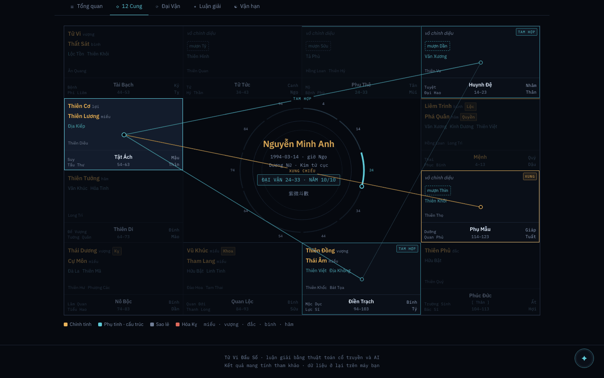
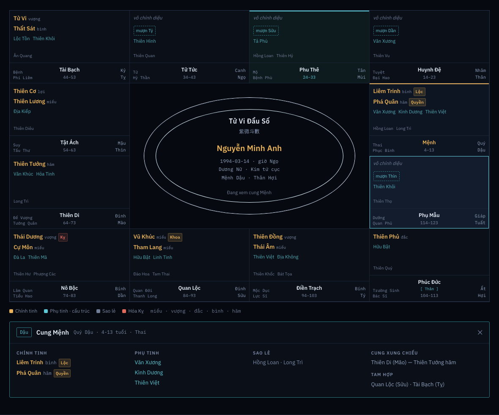
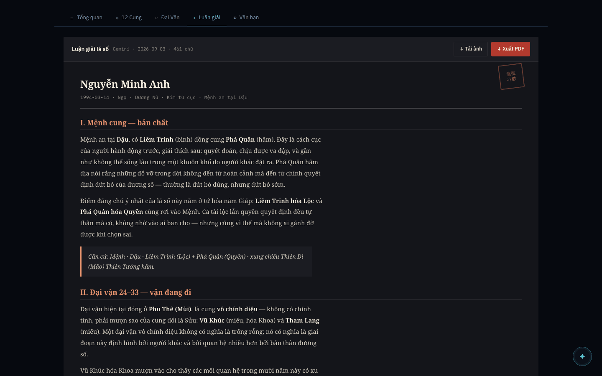
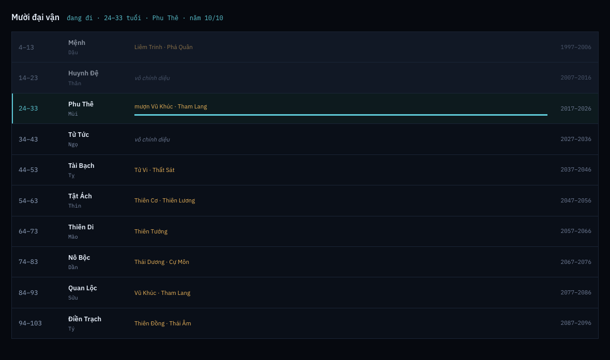
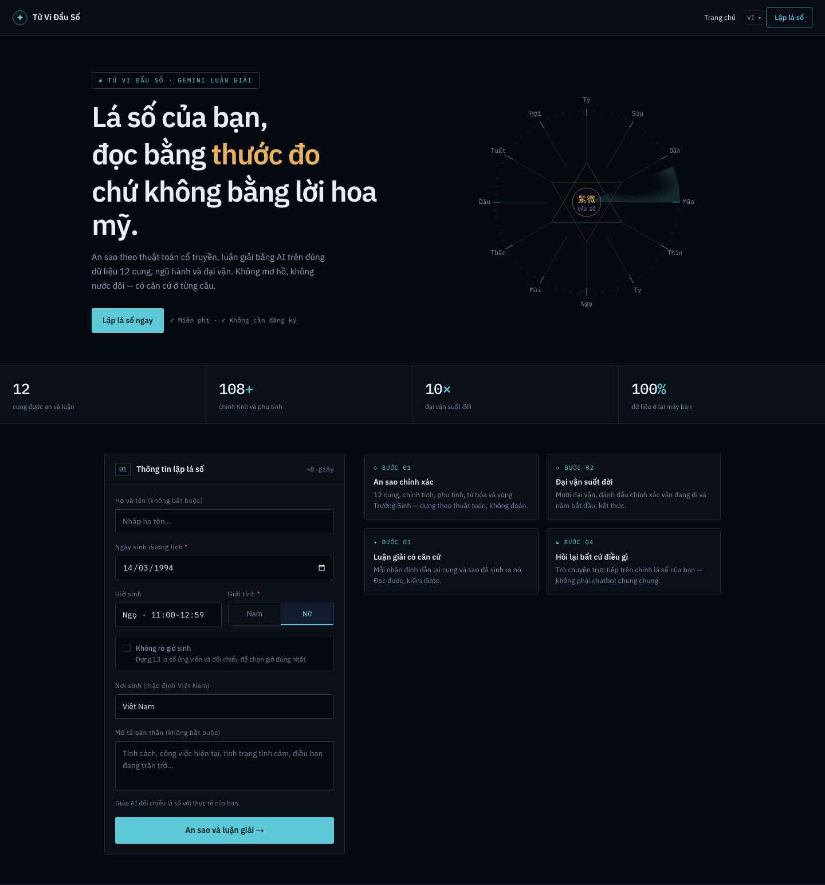
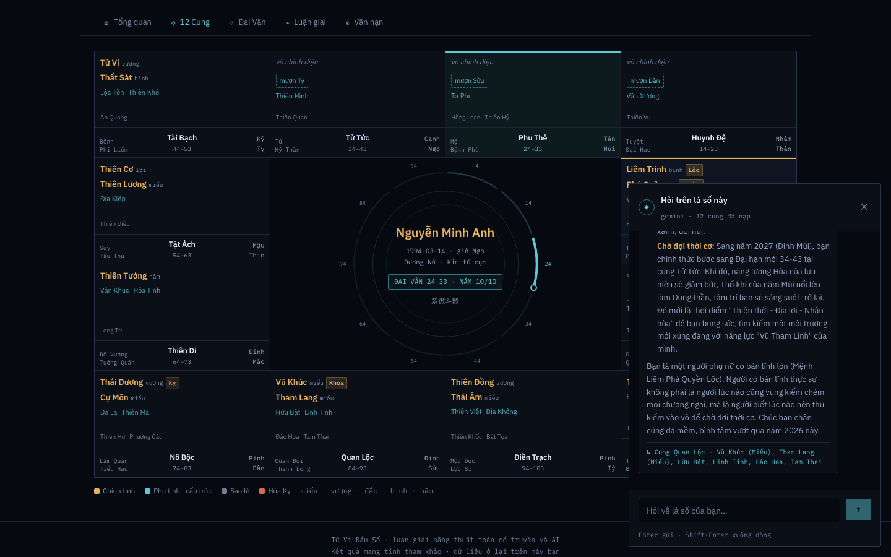
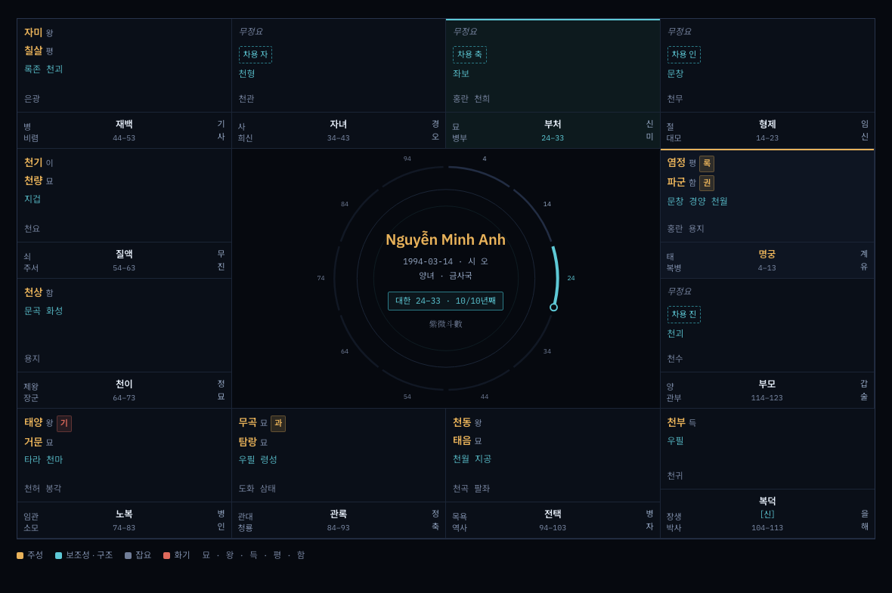

# astro-lens

[English](README.md) · [Tiếng Việt](README.vi.md) · **简体中文** · [繁體中文](README.zh-Hant.md) · [한국어](README.ko.md)

一个紫微斗数排盘与命盘解读生成器。你输入出生日期、时辰与性别；应用在本地排出十二宫
命盘并渲染出来，再交给 Gemini 生成一篇结构化的长篇解读。全部内容——界面、术语，以及
解读本身——都提供五种语言。

视觉体系名为 **Thiên Văn Đài（天文台）**：深色、扁平、以字体为主，只有一种圆角半径，
没有阴影也没有渐变。解读单独呈现在一张浅色「纸」面上——导出的 PDF 抓取的也正是这一面。

---

## 界面预览

[](public/screenshots/chart-relations.png)

**宫位关系浮层** —— 悬停任一宫位，冲照以琥珀色亮起、三合以青色亮起，直接画在盘上。

<table>
<tr>
<td width="50%" align="center"><a href="public/screenshots/chart.png"></a><br><b>十二宫命盘</b></td>
<td width="50%" align="center"><a href="public/screenshots/reading.png"></a><br><b>命盘解读</b></td>
</tr>
</table>

<table>
<tr>
<td width="25%" align="center"><a href="public/screenshots/daivan.png"></a><br><sub><b>大限时间轴</b></sub></td>
<td width="25%" align="center"><a href="public/screenshots/landing.png"></a><br><sub><b>首页</b></sub></td>
<td width="25%" align="center"><a href="public/screenshots/chat.png"></a><br><sub><b>追问对话</b></sub></td>
<td width="25%" align="center"><a href="public/screenshots/chart-ko.png"></a><br><sub><b>韩语</b></sub></td>
</tr>
</table>

所有截图均由内置的开发用样例命盘生成，因此不含任何真实人物的出生数据。用
`npm run screenshots` 重新生成。

---

## 快速开始

**前置条件**

- Node 20 或更新版本（开发环境为 24.4）。`package.json` 未锁定引擎版本。
- 一个 Google Gemini API 密钥。没有密钥时命盘依然能正常计算与渲染——只有解读和
  追问需要联网。

```bash
npm install
echo "GEMINI_API_KEY=your_gemini_api_key_here" > .env   # 创建 .env
npm run dev                                             # http://localhost:3000
```

然后打开 <http://localhost:3000> 填写表单。

若想在不消耗 API 调用的情况下查看界面，在 `/` 或 `/result` 后加上
`?fixture=tuvi-ty`——参见下文[开发用样例命盘](#开发用样例命盘)。

### 环境变量

| 变量 | 是否必需 | 用途 |
|---|---|---|
| `GEMINI_API_KEY` | 生成解读时必需 | Google Gemini 密钥。放进 `.env`（已被 gitignore）。请使用你自己的密钥——绝不要把密钥提交进仓库。 |
| `PARITY_PORT` | 否 | 视觉比对工具自带 dev server 的端口，默认 `3100`。 |
| `SHOT_PORT` | 否 | 截图工具自带 dev server 的端口，默认 `3200`。 |
| `SHOT_ONLY` | 否 | 以逗号分隔的截图名称，用于只重拍其中几张。 |

---

## npm 脚本

| 脚本 | 作用 |
|---|---|
| `npm run dev` | 在 3000 端口启动 Next dev server。 |
| `npm run build` | 生产构建。**与 `dev` 共用 `.next`**——见下文已知问题。 |
| `npm start` | 运行生产构建。 |
| `npm run lint` | ESLint。「干净」的含义是*只*剩下文列出的三个已知错误。 |
| `npm run typecheck` | `tsc --noEmit`。 |
| `npm run test` | Vitest——245 个单元测试。快、不联网，可以随时反复跑。 |
| `npm run test:watch` | 同上，监听模式。 |
| `npm run parity` | Playwright。将十二个渲染出的界面与设计参照稿比对，另含各语言的布局压力测试与减弱动效测试。自带 dev server。 |
| `npm run eval` | **解读质量评测。**真实调用 Gemini，约 20 分钟，花真钱。绝不接入 `test` 或 CI。详见下文。 |
| `npm run screenshots` | 重新生成 `public/screenshots/`。其中对话截图会消耗一次 Gemini 调用。 |
| `./tests/tools/token-audit.sh` | 扫描样式表中违反设计体系的写法：多余的圆角、token 之外的颜色、阴影、渐变。 |

---

## 架构

### 命盘在本地计算

`src/lib/iztro.ts` 封装了 [iztro](https://github.com/SylarLong/iztro)，真正的命理
计算由它完成：公历转农历、十二宫、十四主星、辅星与杂曜环、庙旺状态、四化，以及大限与
流年叠加。整个过程不联网，也不需要密钥。

**无论界面是什么语言，命盘一律以 `vi-VN` 生成**，翻译发生在渲染阶段。这是刻意的设计：
它让越南语输出成为其余一切的连接键，也意味着切换语言永远不需要重新排盘。

`src/lib/branches.ts` 保存界面在 iztro 之外还需要的地支运算——`xung()` 求对宫、
`tamHop()` 求三合的另外两角——宫位关系浮层画的正是这些。`src/lib/bazi.ts` 增加了可选
的八字四柱计算，作为辅助体系并入提示词。

### 解读由三层提示词组成

`src/lib/gemini.ts` 用三部分拼装一次请求：

1. **系统指令**——方法论。与一份参考 PDF（`astro-lens.pdf`）一起打包进 Gemini 的
   *context cache*，因此只上传一次，而不是每次请求都发送。
2. **数据上下文**——命盘，以带标签的文本呈现，每个值都经过术语表转换，好让服务韩语
   读者的模型在 자미 和 명궁 上推理，而不是在 Tử Vi 和 Mệnh 上推理。
3. **任务层**——链式推理流程、自检清单，以及输出模板。每次请求都会发送。

`src/lib/prompt/<locale>.ts` 按语言保存这三层；`src/lib/gemini-cache.ts` 为每种语言
管理一份缓存。

这一层有两件事很容易搞错，而且两件都真出过问题：

- **只要缓存还在，改系统指令就完全没有效果。**缓存只按*显示名称*查找，从不比对内容，
  且 TTL 长达 90 天。按请求变化的规则必须写在任务层。
- **有条件的章节必须删掉，而不是劝阻。**八字章节与自述章节被 `⟦BAZI⟧` / `⟦SELF⟧`
  标记包裹，数据缺失时由 `renderTask()` 整段剔除。实测表明，「若无数据则跳过本节」这
  类指令会被五种语言中的四种无视，然后模型自己把数据编出来。

### 引证

解读中每一项实质判断都带有一行引证，写明其依据的宫与星。在解读正文里它们是 markdown
引用块，渲染成截图中看到的缩进区块。在追问对话里，答案末尾的引证由
`src/lib/citation.ts` 拆出，单独占一行显示，因为对话气泡刻意不渲染引用块。

两个界面共用同一个块级 markdown 解析器 `src/lib/markdown.ts`，所以答案里的标题和列表
会被排版出来，而不是把 `###` 和 `*` 原样显示。它们只在变体上有区别：`document` 输出真正的
标题和 `.sealq` 引证块；`bubble` 把标题变成气泡自身字号的一行加粗引导句，并把 `>` 行按
普通正文渲染。

一条引证可能写到两个宫——在这门术数里对宫本就是依据的一部分——所以任何解析引证的代码
都必须把每颗星归给它*紧随其后*的那个宫，而不是行首的第一个宫。

### 国际化

三类文本，三个不同的归处。把其中一类放进另一类的文件，正是这套结构要防止的错误：

| | 位置 | 规则 |
|---|---|---|
| 界面文案 | `src/lib/i18n/messages/<locale>.ts` | `vi.ts` 是类型来源；其余四份必须完全满足同一个接口。 |
| 领域术语 | `src/lib/i18n/vocabulary.ts` | 单一一张表，约 193 个概念 × 5 种语言，取自 iztro 自身的语言数据，而不是凭记忆写出来的。 |
| 模型提示词 | `src/lib/prompt/<locale>.ts` | 指令语言、输出语言与术语，全部随读者而变。 |

渲染术语值时一律走 `useI18n().v(value, domain)`，不要直接用原始值。

**语言判定**发生在 `src/proxy.ts`——它就是 Next 16 中原先 `middleware.ts` 的新名字。
顺序为 `?lang=` → cookie → `Accept-Language` → `vi`。它从不重写路径，因此所有 URL
保持原样，判定出的语言通过请求头传给渲染层。

### 设计体系是 CSS，不是工具类

整套视觉体系以语义化的组件类写在 `src/app/globals.css` 里——`.pal`、`.maj`、
`.centre`、`.tl-row`、`.paper`、`.sealq`、`.kv`、`.card`。组件只输出这些类名，而不是
就地重写样式。项目装了 Tailwind，用来处理零散布局没问题，但**新的界面应当复用已有的
组件类，或者往 `globals.css` 里新增一个。**

那些不可妥协的约束由 `./tests/tools/token-audit.sh` 机械检查：只有一种圆角
（`3px`），不得使用模糊、辉光、投影式阴影或渐变文字，颜色只能取自 CSS 变量，凡是计数
或写日期的地方一律用等宽字体族。改过样式之后请跑一遍这个检查。

---

## 五种语言

`vi`（默认）· `zh-Hans` · `zh-Hant` · `ko` · `en`。

支持是贯通到底的。界面、星名宫名，以及生成的解读，都使用读者的语言——韩语用户拿到的
是一篇用韩语星名推理的韩语解读，而不是一层裹在越南语解读外面的韩语外壳。

用 `?lang=ko`（或 `zh-Hans`、`zh-Hant`、`en`、`vi`）切换，也可以用应用栏里的语言选择
器。选择结果记在 cookie 中。

---

## 测试

### `npm run test` —— 245 个单元测试

宫位关系运算、地支映射、大限进度、术语表的完整性、提示词包的结构、打印变体，以及解读
质量检查器本身。不联网。这是你应当频繁运行的那一个。

请注意：**评测用的检查器自身也有单元测试**，用的是带有刻意错误的合成解读。绝不要为了
验证某个检查器能正常工作而消耗一次 API 调用。

### `npm run eval` —— 解读质量

这是唯一检验模型*实际说了什么*的工具，并且是拿它收到的那张命盘来对照。它会跑两张冻结
的标准命盘 × 五种语言 = 十篇真实解读。

> **耗时约 20 分钟，并产生真实的 API 费用。**它被刻意排除在 `npm run test` 之外，
> 也绝不能加进 CI。

五项确定性检查，全部通过术语表工作，因此在五种语言下都成立，而不是去匹配越南语字符串：

| 检查 | 验证什么 |
|---|---|
| 1 · 凭空捏造 | **星曜落宫。**解读放进某宫的每一颗主星都必须真的在那一宫，空宫借星的情况予以接受。它问的不是「这颗星在不在盘上」——一张完整的命盘早已把二十八颗主星与辅星都安放在某处，那样问毫无意义。 |
| 2 · 覆盖度 | 十二宫是否都确实论述到了。 |
| 3 · 语言 | 正文是否使用读者的文字体系，以及是否夹带了从命盘数据里漏出来的越南语。 |
| 4 · 长度 | 正文是否达到其自身提示词所要求的篇幅。 |
| 5 · 结构 | 编号章节是否齐全且顺序正确、有条件的章节是否只在对应数据存在时出现，以及论断章节是否带有引证。 |

常用参数：`--locale`、`--chart`、`--tag`，以及 `--reuse`——用已保存的解读重跑检查，
**完全不**调用 API。解读文件写入 `tests/eval/out/<tag>/`。[EVAL.md](EVAL.md) 记录了
历次运行的发现，也包括促成多次检查器重写的那些实测数据。

### `npm run parity` —— 视觉还原度

十二个界面在两种视口下渲染并与一份冻结的设计参照稿比对，另有二十项各语言布局压力测试
和一套减弱动效测试。

**判定标准是几何，不是像素。**测试会报告像素差异百分比，但那个数字只是近似指标，有几
个界面超过 0.5% 的阈值是完全合理的。真正起决定作用的是*盒子*是否对齐——每个界面选择
器列表中各元素的位置、尺寸与间距——因为这与字形如何被光栅化无关。[PARITY.md](PARITY.md)
记录了每一项测量、每一处被接受的偏差及其理由。**在改动任何视觉内容之前请先读它**；有
若干看起来像「缺陷」的地方，其实是有来龙去脉的既定决策。

该工具会先停掉正在运行的 dev server 再启动自己的，因为 Next 16 规定每个项目目录只能有
一个 dev server，而且若不这样做，Turbopack 会把过期的样式表发给无头浏览器。

### 开发用样例命盘

在 `/` 或 `/result` 上加 `?fixture=tuvi-ty`，会从 `src/lib/fixture.ts` 载入一张预置的
教科书式命盘，含一篇预先写好的解读，并且把大限的参照日期钉死，使快照不会在跨年时失效。
视觉比对界面与本 README 的截图正是靠它保持可复现。

当 `NODE_ENV === 'production'` 时 `loadFixture` 返回 `null`，因此在已部署的构建里无法
访问到它。

---

## 已知限制与粗糙之处

以下都是真实且当前有效的情况。它们并不神秘，写下来是为了让你不必重新踩一遍。

- **一篇完整解读大约需要三分钟。**这是一次高推理强度的长篇结构化生成。界面会显示等待
  状态；除非让解读变短，否则没有办法让它变快。
- **改动缓存显示名称会让旧缓存被弃置。**Gemini 只按显示名称查找 context cache，因此
  修改 `src/lib/gemini-cache.ts` 里的 `CACHE_DISPLAY_NAME` 会悄无声息地抛弃现有的
  90 天缓存，并迫使参考 PDF 重新上传。在缓存重新预热之前，每种语言的第一篇解读都会更
  慢。项目改名为 `astro-lens` 时发生的正是这件事。
- **`npm run lint` 报三个错误属于预期状态。**它们是
  `src/app/api/candidates/route.ts` 中早已存在的三处
  `@typescript-eslint/no-explicit-any`（第 35、38、41 行）。只剩这三条时 lint 即视为
  「干净」。除此之外的任何输出都是你引入的。
- **`next build` 与 `next dev` 共用 `.next`。**先构建再在同一目录启动 dev server，可能
  导致 dev server 对所有路由都返回 404。`rm -rf .next` 后重启即可。
- **CJK 字体来自 Google Fonts 样式表，而非 `next/font`。**`next/font/google` 没有
  Noto 系列的 CJK 子集，会在构建时把每一个 unicode-range 切片都自托管一遍。根布局改为
  按当前语言引入一份样式表，后面兜底一套系统 CJK 字体栈。
- **越南语声调符号需要留意。**字体必须加载 `vietnamese` 子集；给带动画的越南语文本直接
  加 `overflow: hidden` 会把 dấu nặng 和 dấu hỏi 裁掉——请使用 `globals.css` 里已有的
  padding／负 margin 组合。
- **TOON 编码试过，已删除。**[EVAL.md](EVAL.md) §4 留下了实测数字：它把命盘数据上下文
  压缩了 22.6%，但那部分只占提示词的 4.3%，整次调用因此只动了 1.79%，实际耗时纹丝不动。
  若要重新考虑，请先读 §4。

---

## 仓库结构

```
src/
  app/                 Next App Router —— 页面与三个 API 路由
    api/analyze/       生成解读
    api/chat/          追问对话
    api/candidates/    出生时辰未知时的候选命盘
  components/
    chart/             命盘网格、详情抽屉、大限表格、解读正文
    chat/              对话面板
    ui/                表单、页首、页脚、加载界面
  lib/
    iztro.ts           排盘
    bazi.ts            可选的八字四柱
    branches.ts        冲照／三合运算
    chart-derived.ts   空宫借星
    rel-overlay.ts     宫位关系连线
    citation.ts        从对话答案中拆出引证
    markdown.ts        两个界面共用的块级 markdown 解析器
    gemini.ts          提示词拼装
    gemini-cache.ts    按语言划分的 context cache
    prompt/            五套提示词包
    i18n/              界面文案、术语表、语言判定
    fixture.ts         开发用样例命盘
  proxy.ts             语言判定（Next 16 的 middleware）
tests/
  unit/                vitest
  parity/              Playwright 视觉比对
  eval/                解读质量评测工具
  tools/               截图、PDF 导出、无障碍与设计 token 检查
```

延伸阅读，均在本仓库内：[AGENTS.md](AGENTS.md) 是动手改任何东西之前值得先知道的约定，
[PARITY.md](PARITY.md) 是视觉记录及其既定决策，[EVAL.md](EVAL.md) 则是模型输出实际被
测量出的表现。
